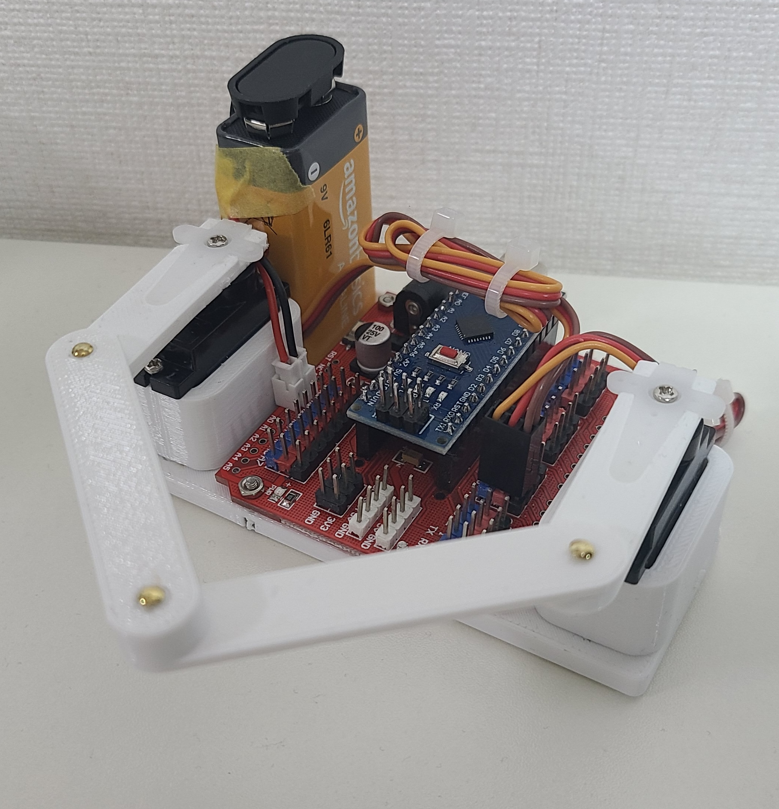

# Five-Bar Parallel Robot



Inverse-kinematics control of a symmetric five-bar parallel robot driven by two SG90 servos on an Arduino Nano. The Arduino runs the IK solver; a small Python REPL on the host sends Cartesian targets over USB serial.

### Repository layout

```
firmware/five_bar_ik/five_bar_ik.ino   Arduino sketch
host/five_bar_client.py                Python serial REPL
```

The sketch sits inside a same-named subdirectory because `arduino-cli` requires the `.ino` filename to match its parent directory.

### Python environment

Python 3.12 is used to line up with ROS 2 Jazzy for future ROS integration. Create the venv at a centralized location and install the one runtime dependency:

```
uv venv ~/.uv/envs/five_bar --python 3.12
source ~/.uv/envs/five_bar/bin/activate.fish
uv pip install pyserial matplotlib ipympl jupyter
```

### Serial port access

Add your user to the `dialout` group so `/dev/ttyUSB0` is accessible without `sudo`:

```
sudo usermod -aG dialout $USER
```

Start a new login session (or run `newgrp dialout` in a fresh shell) for the group to take effect.

### arduino-cli

Do not use the snap version — its AppArmor profile blocks `serial-discovery` from enumerating USB devices. Install the upstream binary instead. The environment variable must come after `sudo` because `sudo` strips the parent environment by default:

```
curl -fsSL https://raw.githubusercontent.com/arduino/arduino-cli/master/install.sh | sudo BINDIR=/usr/local/bin sh
```

Then bootstrap the toolchain. The Servo library is not bundled with the AVR core and has to be installed separately:

```
arduino-cli config init
arduino-cli core update-index
arduino-cli core install arduino:avr
arduino-cli lib install Servo
```

### Flash the sketch

```
arduino-cli compile --fqbn arduino:avr:nano firmware/five_bar_ik
arduino-cli upload -p /dev/ttyUSB0 --fqbn arduino:avr:nano:cpu=atmega328old firmware/five_bar_ik
```

The `:cpu=atmega328old` variant is required for CH340 Nano clones, which ship with the old bootloader and otherwise fail with `not in sync: resp=0x00`. Genuine Nanos and clones with optiboot can drop that suffix.

### Run the host client

```
python host/five_bar_client.py --port /dev/ttyUSB0
```

Wait for the `READY five_bar_ik` banner, then use `move <x> <y>` to send a coordinate in millimetres, `home` to park at the home pose, `status` to read back servo angles, `release` to detach servos, or `quit` to exit. Quitting sends a release first, so the servos are de-energised when the client closes.

Pass `--plot` to open a live 2D matplotlib view of the full linkage that animates each move alongside the physical robot. The view is purely visual — the Arduino remains the source of truth for motion.

For a notebook workflow (e.g. VS Code over a remote SSH connection), open `notebooks/five_bar_demo.ipynb`. It uses `%matplotlib widget` to animate the linkage in place while cells like `move(20, 50)` drive the physical robot.

### Workspace and singularities

The reachable workspace is bounded by two kinds of singularity. The outer boundary is the serial singularity where one arm reaches full extension (`r = L1 + L2`); the inverse-kinematics solver rejects targets past it as out of range. The inner boundary is the parallel (type-II) singularity where the two elbows splay to nearly maximum separation and the distal links become colinear — at that pose the mechanism loses constraint and the motors can bind. A practical safe zone for the current geometry is roughly `y ∈ [45, 72] mm` on the `x = 0` axis, narrowing off-axis. The host client and notebook compute the parallel-singularity clearance for every `move` and print `warn: near singularity (clearance <h> mm)` when it drops below `SINGULARITY_MARGIN_MM` (8 mm by default). The command is still sent — the warning exists so you can back off before the linkage stalls.

### Calibration

Home pose is both arms vertical, which corresponds to `THETA1_OFFSET_DEG` and `THETA2_OFFSET_DEG` (defaults 90°, 90°). Calibration aligns the physical arms to that definition.

Mechanical step: power the board, send `home`, then with the servo still powered loosen each horn screw, lift the horn straight off the spline (do not rotate the shaft itself), align the arm to vertical, and re-seat the horn. Tighten and repeat for the other arm. The 21-tooth spline gives ~17° resolution per tooth, so this gets within ±8° of vertical. Pictures to be added.

Software step: send `home`, observe the residual tilt, bump `THETA1_OFFSET_DEG` or `THETA2_OFFSET_DEG` by a few degrees, reflash, repeat. If the arm rotates the wrong way, flip the corresponding `THETA_SIGN` between `+1` and `-1`.

### Hardware notes

The geometry constants `L1`, `L2`, and `BASE_D` at the top of the sketch are placeholders — measure your physical links and edit those values before expecting `move` to land accurately. Do not power both SG90s from the Nano's onboard 5 V regulator; they can briefly draw over an amp together and will brown out the board. Use a separate 5 V supply for the servos and tie its ground to Arduino GND.
